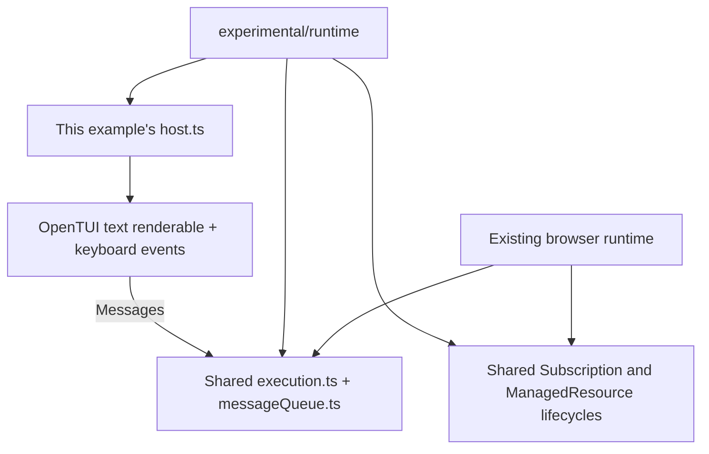

# OpenTUI runtime spike

This counter exercises `foldkit/experimental/runtime` with a real OpenTUI renderer. Browser and terminal applications share Foldkit's Message queue, Model transition and Command executor, Subscription machinery, and ManagedResource machinery.



From the repository root:

```sh
pnpm install
pnpm --filter foldkit build
pnpm --filter @foldkit-internal/opentui-counter dev
```

The development command uses Bun. The example pins `@opentui/core` to the published version in its package manifest.

- **Up / Down:** increment or decrement.
- **a:** run a Command that increments after one second.
- **Space:** start or stop a one-second timer Subscription.
- **q / Ctrl+C:** stop the runtime, interrupt pending work, and release the renderer.

`main.ts` holds the Schema-defined Model and Messages, pure update and view, Command, and Subscription. `host.ts` owns the persistent OpenTUI text renderable and input listeners through Effect scopes. `entry.ts` creates the application.

This is an execution-boundary spike. Its pure view returns text, and its host updates one persistent renderable. Declarative widget-tree reconciliation and Foldkit's build-generated branch identity are subsequent adapter work.

## Verification

```sh
pnpm --filter @foldkit-internal/opentui-counter typecheck
pnpm --filter @foldkit-internal/opentui-counter test
```
